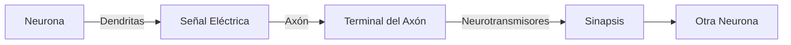

# RAG PDF Assistant

A Retrieval-Augmented Generation (RAG) system built with LangChain that allows you to chat with your PDF documents.

## Features

- **PDF Processing**: Convert PDF files into markdown format, handling images and tables
- **Embeddings Generation**: Create vector embeddings from markdown files for efficient similarity search
- **Query Pipeline**: Process user queries and retrieve relevant information from your documents
- **Streamlit Chat Interface**: Interact with your documents through a user-friendly chat interface

## Setup

1. Clone this repository
2. Create a virtual environment
   ```
   python3.12 -m venv .venv
   ```
3. Activate environment
   ```
   source .venv/bin/activate
   ```
3. Install the required dependencies:
   ```
   pip install -r requirements.txt
   ```
4. Set up your OpenAI API key (either in a .env file or directly in the app)
5. Run the Streamlit app:
   ```
   streamlit run app.py
   ```

## Usage

1. Upload your PDF files using the sidebar
2. Click "Process PDFs" to extract content and generate embeddings
3. Ask questions about your documents in the chat interface
4. View source information by expanding the "View Sources" section

## Project Structure

```
rag_project/
│
├── app.py                      # Main Streamlit application
├── requirements.txt            # Project dependencies
│
├── src/
│   ├── __init__.py
│   ├── pdf_processor.py        # PDF to markdown conversion
│   ├── embeddings.py           # Generate embeddings and vector DB
│   └── chat_processor.py       # Handle user queries
│
└── data/
    ├── pdfs/                   # Directory for input PDF files
    ├── markdown/               # Directory for processed markdown files
    └── vector_db/              # Directory for vector database files
```

## System Components

### 1. PDF Processor
- Handles PDF file conversion to markdown format
- Extracts text, images, and tables from PDFs
- Preserves document structure in the markdown output

### 2. Embeddings Generator
- Creates vector embeddings from markdown files
- Supports both OpenAI and local embeddings models
- Stores embeddings in a Chroma vector database

### 3. Chat Processor
- Processes user queries using LangChain's ConversationalRetrievalChain
- Retrieves relevant document chunks based on semantic similarity
- Maintains conversation context for follow-up questions

### 4. <u>App.py</u>: Streamlit Interface
- Provides an intuitive chat interface
- Allows users to upload and process PDF files
- Displays answers and source documents

## Dependencies

- **Python 3.12+**
- **LangChain**: For RAG functionality
- **OpenAI API**: For embeddings and language model
- **Chroma DB**: For vector storage
- **Streamlit**: For the web interface
- **PyPDF2 & related libraries**: For PDF processing

## License

MIT

## Notes

- For PDF processing with images: Tesseract OCR and Poppler may be required
- Local embedding models require additional disk space but reduce API costs
- The system performs best with well-structured PDF documents

---



