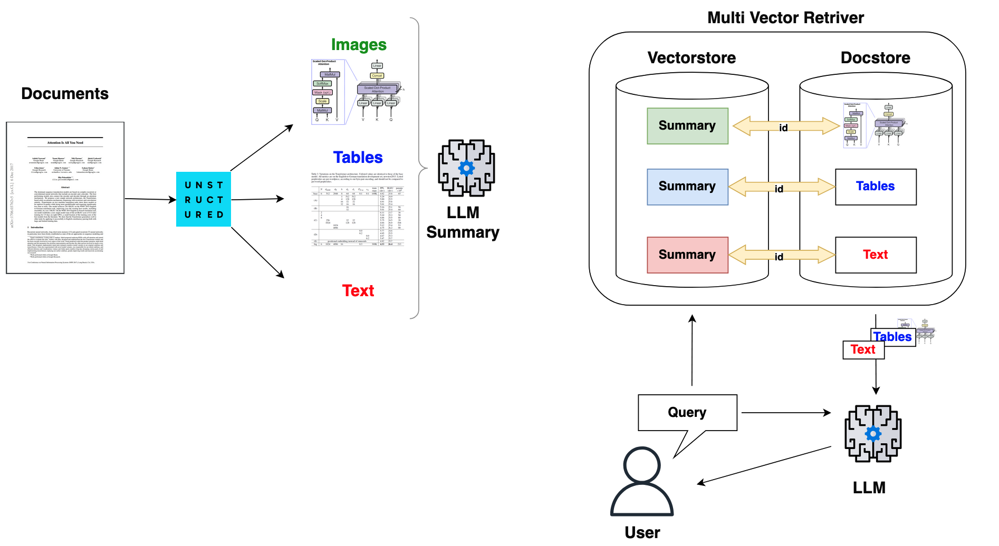

# Multi-Modal PDF RAG Chatbot 📄🤖

This project implements a Retrieval-Augmented Generation (RAG) system capable of processing PDF documents containing text, tables, and images. Users can upload PDFs, have their content extracted and processed, and then engage in a chat conversation to ask questions about the document content. The system leverages multi-modal capabilities to understand and retrieve information from text, tables, and images.

## Features ✨

*   **PDF Processing:** Upload new PDFs or select existing ones from the `data/pdfs` directory.
*   **Content Extraction:** Extracts text, tables, and images (as base64) from PDFs using the `unstructured` library.
*   **Multi-Modal Summarization:**
    *   Text and table chunks are summarized using Groq API (Llama 3.1 8B).
    *   Image chunks (base64) are summarized using Azure OpenAI GPT-4 Vision.
*   **Vector Embeddings:** Generates embeddings for the content *summaries* using OpenAI's `text-embedding-3-small`.
*   **Persistent Storage:**
    *   Stores vector embeddings and metadata in a persistent ChromaDB database (`data/database/vector_db/`).
    *   Stores the *original* extracted text, tables, and base64 images in a persistent SQLite database (`data/database/sql/docstore.db`) for accurate context retrieval.
*   **RAG Chat Interface:** A Streamlit-based UI (`app.py`) for uploading, processing, and interacting with the documents.
*   **Context-Aware Responses:** Retrieves relevant *original* text, table, and image context based on user queries and uses this context to generate answers with Azure OpenAI (GPT-4 Vision).
*   **Context Display:** Shows the specific text snippets and images used as context to generate the assistant's response within an expandable section.
*   **Database Management:** Allows clearing the vector and document stores via the UI sidebar.

## Architecture Overview 🏗️


1.  **PDF Upload/Selection (`app.py`):** User provides a PDF via the Streamlit interface.
2.  **Content Extraction (`pdf_processor.py`):** `unstructured` partitions the PDF into text, table, and image (base64) chunks.
3.  **Summarization (`embeddings.py`):**
    *   Text/Table chunks summarized via Groq.
    *   Image chunks summarized via Azure OpenAI Vision.
4.  **Embedding Generation (`embeddings.py`):** OpenAI embeds the *summaries*.
5.  **Data Persistence (`embeddings.py`, `sqlite_processor.py`):**
    *   **ChromaDB:** Stores summary embeddings + metadata (type, original\_doc\_id).
    *   **SQLite:** Stores *original* content (text, tables, images) keyed by `doc_id`.
6.  **User Query (`app.py` -> `embeddings.py`):** User asks a question.
7.  **Retrieval (`embeddings.py`):** Query embedded -> ChromaDB similarity search on summaries -> Retrieve top-k `doc_id`s.
8.  **Context Fetching (`embeddings.py`):** Fetch *original* data from SQLite using retrieved `doc_id`s.
9.  **Prompt Construction (`embeddings.py`):** Build prompt for Azure OpenAI Vision with user query + *original* context (text, tables, images).
10. **Answer Generation (`embeddings.py`):** Azure OpenAI generates answer based on prompt.
11. **Response Display (`app.py`):** Display answer and expandable *original* context in Streamlit chat.

## Visuals 📸


**Example: Upload Tab**


**Example: Chat Tab with Context**


**Example: Sidebar**


## Technology Stack 🛠️

*   **Backend:** Python 3.12
*   **Frontend:** Streamlit
*   **PDF Parsing:** `unstructured`
*   **Vector Database:** ChromaDB (Persistent)
*   **Document Store:** SQLite
*   **Embeddings:** OpenAI API (`text-embedding-3-small`)
*   **Text/Table Summarization:** Groq API (Llama 3.1 8B)
*   **Image Summarization & RAG:** Azure OpenAI API (GPT-4 Vision)
*   **Environment Management:** `python-dotenv`, `venv`

## Setup and Installation ⚙️

1.  **Prerequisites:**
    *   Python 3.12+
    *   `pip` (Python package installer)
    *   Git (for cloning the repository)
    *   **System Dependencies for `unstructured`:**
        *   **Debian/Ubuntu:** `sudo apt-get update && sudo apt-get install -y poppler-utils tesseract-ocr libmagic-dev`
        *   **macOS:** `brew install poppler tesseract libmagic`
        *   **Windows:** Requires manual installation. See [unstructured documentation](https://docs.unstructured.io/open-source/installation/installation).

2.  **Create and Activate Virtual Environment:**
    ```bash
    python3 -m venv .venv  # Or python -m venv .venv
    source .venv/bin/activate  # On Windows use `.venv\Scripts\activate`
    ```
    If you want to force the venv to be 3.12 then:
    ```bash
    python3.12 -m venv .venv 
    ```

3.  **Install Python Dependencies:**
    ```bash
    pip install -r requirements.txt
    ```
    <span style="color:orange;">&#9888;</span> <strong>Warning:</strong> You may need to install poppler, tesseract and libmagic, read this file to check if it's needed in your configuration.


4.  **Configure Environment Variables:**
    Create a file named `.env` in the root directory of the project and add your API keys and Azure configuration:
    ```env
    # Essential Keys
    OPENAI_API_KEY="sk-..."
    GROQ_API_KEY="gsk_..."
    AZURE_API_KEY="..."
    AZURE_ENDPOINT="https://<your-resource-name>.openai.azure.com/"
    AZURE_DEPLOYMENT_NAME="<your-gpt4-vision-deployment-name>" # Deployment capable of vision
    AZURE_API_VERSION="<your-api-version>" # e.g., 2023-12-01-preview or later
    ```
    **Important:** Ensure your Azure OpenAI deployment (`AZURE_DEPLOYMENT_NAME`) supports vision capabilities.

## Running the Application ▶️

1.  Make sure your virtual environment (`.venv`) is activated.
2.  Ensure the `.env` file is correctly configured in the project's root directory.
3.  Navigate to the project's root directory in your terminal.
4.  Run the Streamlit application:
    ```bash
    streamlit run app.py
    ```
5.  The application should open automatically in your default web browser.

## Usage Guide 🚀

1.  **Navigate to the "📤 Upload & Process PDF" Tab:**
    *   Choose "Upload New PDF" or "Use Existing PDF" (from `data/pdfs/`).
    *   Select/upload your desired PDF.
    *   Click the "🚀 Process PDF" button. Wait for the multi-step processing (Extraction, Summarization, Persistence) to complete. Status updates and previews will be shown.

2.  **Navigate to the "💬 Chat with Documents" Tab:**
    *   Once processing is done (or if data exists), you can start chatting.
    *   Type your question in the input box at the bottom.
    *   The app retrieves context (original text/images) and generates an answer using Azure OpenAI.
    *   The answer is displayed, along with an expandable "Show Context Used" section showing the exact text and images used.
    *   Use "Clear Chat History" to reset the conversation display.

3.  **Use the Sidebar:**
    *   Check the "Stored Documents (Chunks)" count.
    *   Click "⚠️ Clear All Databases" to remove all data from ChromaDB and SQLite (requires re-processing).

## Project Structure 📁

```
.
├── README.md # This file
├── app.log # Log file for application events
├── app.py # Main Streamlit application script
├── data/
│ ├── database/
│ │ ├── sql/
│ │ │ └── docstore.db # SQLite DB for original content (text, tables, images)
│ │ └── vector_db/ # ChromaDB persistent storage directory
│ │ └── ... # ChromaDB internal files
│ ├── pdfs/ # Directory for input PDF files
│ │ ├── RECETA_DE_LA_PAELLA.pdf
│ │ └── attention_is_all_you_need.pdf
│ └── prompts/ # Directory for prompt templates
│ ├── summary_image.txt
│ ├── summary_text.txt
│ └── user_query.txt
├── notebook/ # Directory for exploratory notebooks (optional)
├── requirements.txt # Python package dependencies
└── src/
├── init.py
├── embeddings.py # Handles summarization, embeddings, DB interactions, RAG logic
├── pdf_processor.py # PDF parsing and content extraction via unstructured
└── sqlite_processor.py # Wrapper for SQLite operations (original content store)
```

## System Components Explained

*   **`app.py`**: The main entry point. Runs the Streamlit web interface, handles UI elements (tabs, buttons, chat), orchestrates calls to processing and chat functions, and manages session state.
*   **`src/pdf_processor.py`**: Uses the `unstructured` library to parse input PDFs. Extracts raw text, tables, and images (as base64 strings) into distinct chunks.
*   **`src/embeddings.py`**: The core RAG logic engine.
    *   Manages connections to ChromaDB and SQLite.
    *   Calls Groq and Azure OpenAI APIs for multi-modal summarization of extracted chunks.
    *   Generates embeddings (using OpenAI) for the *summaries*.
    *   Persists embeddings/metadata to ChromaDB and *original* content to SQLite.
    *   Handles user query processing: embeds query, retrieves relevant document IDs from ChromaDB based on summary similarity.
    *   Fetches the corresponding *original* context (text/images) from SQLite.
    *   Constructs the final prompt with query and original context for Azure OpenAI.
    *   Calls Azure OpenAI to get the final answer.
*   **`src/sqlite_processor.py`**: A helper class providing an interface (`mset`, `get`, `delete`, `count`, `clear`) to interact with the SQLite database (`docstore.db`), which stores the original extracted PDF content.
*   **`data/prompts/`**: Contains text files used as templates for generating summaries and formulating the final RAG query.
*   **`data/database/`**: Holds the persistent data stores (ChromaDB vector index and SQLite document store).

## Troubleshooting ⚠️

*   **`unstructured` / System Dependency Errors:** Ensure `poppler`, `tesseract`, and `libmagic` are correctly installed for your OS and accessible in the PATH.
*   **ChromaDB Errors (`sqlite3.OperationalError: database is locked` / Corruption):** Stop the app, **delete** the `data/database/vector_db/` directory, restart the app, and re-process PDFs.
*   **API Key / Endpoint Errors:** Double-check all keys and Azure configuration details (`ENDPOINT`, `DEPLOYMENT_NAME`, `API_VERSION`) in your `.env` file. Ensure the Azure deployment is active and supports vision.
*   **Missing `torch`:** Install PyTorch (`pip install torch`) if required by underlying models or `unstructured` configurations.

## License

MIT

## Notes

*   The quality of extraction heavily depends on the structure and quality of the input PDF. Scanned PDFs without OCR layers might yield poor results.
*   API costs will be incurred for OpenAI (embeddings), Groq (summarization), and Azure OpenAI (summarization, RAG).